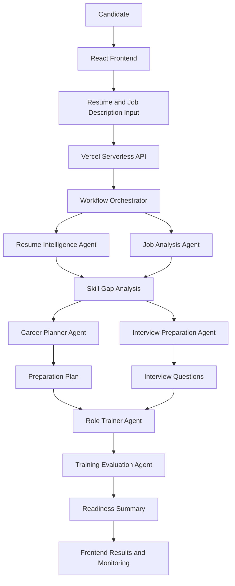

# PlacementPilot

**An AI-powered, multi-agent placement preparation platform that transforms your resume and target job description into a personalized interview preparation and career readiness plan.**

[Take a visit to PlacementPilot](https://placement-pilot-lake.vercel.app/) 

---

## Overview

PlacementPilot is an AI-powered placement preparation assistant designed to help students and job seekers prepare strategically for technical interviews and job applications.

Instead of relying on generic interview questions and study plans, PlacementPilot analyzes a candidate's resume, target job description, and career goals to generate personalized insights, identify skill gaps, recommend learning paths, and simulate interview experiences.

The platform uses a multi-agent architecture in which specialized AI components handle different stages of the placement preparation workflow. These components work together through a coordinated application workflow to provide a structured and personalized preparation experience.

## Key Features

- **Resume Intelligence:** Extracts and analyzes relevant information from uploaded resumes to identify skills, experience, projects, and technical strengths.
- **Job Description Analysis:** Analyzes target job descriptions to identify required skills, technologies, responsibilities, and role expectations.
- **Skill Gap Analysis:** Compares a candidate's existing skills with job requirements to identify strengths and areas that need improvement.
- **Placement Analytics:** Presents insights into a candidate's job readiness, skill coverage, and preparation progress.
- **Personalized Preparation Plan:** Generates a structured preparation roadmap based on the candidate's profile, skill gaps, and target role.
- **Interview Question Generation:** Produces role-specific technical and behavioral interview questions.
- **Role-Based Training:** Provides interactive practice sessions tailored to the selected job role and its technical requirements.
- **AI Answer Evaluation:** Evaluates submitted answers and provides feedback on correctness, relevance, completeness, and areas for improvement.
- **Mock Interview:** Simulates interview scenarios to help candidates practice responding to questions.
- **Readiness Summary:** Generates a consolidated overview of preparation results, highlighting strengths and remaining improvement areas.
- **Execution Monitoring:** Displays workflow progress, agent execution steps, processing duration, and available model usage information.
- **Demo Mode:** Supports a demonstration workflow without requiring a live AI provider connection.

## Multi-Agent Architecture

PlacementPilot uses specialized logical agents to divide the placement preparation process into manageable tasks.

Each agent focuses on a specific responsibility, while the application coordinates the overall workflow.

| Agent | Responsibility |
|---|---|
| Resume Intelligence Agent | Extracts candidate information, skills, projects, and experience from resumes. |
| Job Analysis Agent | Identifies job requirements, technical skills, and role expectations from job descriptions. |
| Skill Gap Agent | Compares candidate capabilities with job requirements and identifies missing skills. |
| Interview Preparation Agent | Generates relevant interview questions and preparation recommendations. |
| Career Planner Agent | Creates personalized learning paths and preparation roadmaps. |
| Role Trainer Agent | Conducts role-specific practice and training sessions. |
| Training Evaluation Agent | Evaluates candidate answers and provides structured feedback. |

These agents are application-level components rather than separately deployed autonomous services. Their execution is coordinated through the platform's workflow.

## System Architecture



## Application Workflow

### 1. Candidate Profile Input

The candidate provides:
- Resume in PDF format
- Target job description
- Career goals or preferred role

Resume text is extracted locally using PDF.js before being processed by the application.

### 2. Resume and Job Analysis

The platform analyzes the resume and job description to identify:
- Technical skills
- Programming languages and frameworks
- Projects and experience
- Required job competencies
- Role-specific expectations

### 3. Skill Gap Identification

The platform compares the candidate's current capabilities with the target job requirements.

The analysis identifies:
- Existing strengths
- Missing or underdeveloped skills
- Important technologies to focus on
- Areas requiring additional preparation

### 4. Personalized Preparation

Based on the analysis, PlacementPilot generates:
- A personalized preparation roadmap
- Priority topics
- Recommended practice activities
- Technical and behavioral interview questions

### 5. Interactive Role Training

Candidates can practice questions relevant to their target role and receive AI-generated feedback.

The training workflow helps candidates identify weaknesses and improve their answers through repeated practice.

### 6. Evaluation and Readiness Summary

The evaluation workflow assesses practice responses and consolidates preparation insights into a readiness summary.

This gives candidates a clearer understanding of their current preparation level and the areas they should focus on next.

## Technology Stack

| Category | Technologies |
|---|---|
| Frontend | React, Vite, TypeScript |
| Styling | Custom CSS |
| Backend | Vercel Serverless Functions |
| AI Model | Google Gemini API |
| Document Processing | PDF.js |
| Language | TypeScript |
| Deployment | Vercel |
| Session Persistence | Browser localStorage |

## Stateless Backend Design

PlacementPilot uses a stateless serverless backend.

Each API request is processed independently, without relying on persistent server-side session storage.

Key characteristics include:
- No traditional application database
- No server-side resume storage
- No authentication system in the current implementation
- Server-side AI provider key management
- Client-side session persistence using localStorage
- Independent serverless API execution

This design keeps the application lightweight and simplifies deployment.

## API Endpoints

The application exposes the following API endpoints.

| Method | Endpoint | Description |
|---|---|---|
| GET | `/api/health` | Checks API availability. |
| POST | `/api/placement-analysis` | Processes placement analysis requests. |
| POST | `/api/training-question` | Generates or processes role-specific training questions. |

The backend validates incoming data and handles AI model interactions through server-side API functions.

## Monitoring and Execution Tracking

PlacementPilot includes an execution monitoring interface that provides visibility into the preparation workflow.

Depending on the available execution data, it displays:
- Current workflow status
- Individual agent execution steps
- Processing duration
- Model and token usage information
- Validation results
- Recovery and error information

This helps users understand how the application processes their placement preparation requests.

## Demo Mode

PlacementPilot supports a demo mode that allows users to explore the application without making live AI API calls.

To enable demo mode, configure:

```env
DEMO_MODE=true
```

Demo mode is useful for testing the user interface, demonstrating application workflows, and exploring the platform without depending on an active AI provider connection.

## Getting Started

### Prerequisites

Ensure that the following tools are installed:

- Node.js
- npm
- Git
- Google Gemini API key for live AI functionality

### Clone the Repository

```bash
git clone https://github.com/aadhisesha/PlacementPilot.git
cd PlacementPilot
```

### Install Dependencies

```bash
npm install
```

### Configure Environment Variables

Create a `.env` file in the project root and configure the required environment variables.

For live AI functionality, provide your Gemini API key using the environment variable expected by the backend.

For demonstration purposes, demo mode can be enabled:

```env
DEMO_MODE=true
```

Do not expose API keys in frontend code or commit environment files containing secrets.

### Run the Development Server

```bash
npm run dev
```

Open the local URL provided by Vite in your browser.

### Build for Production

```bash
npm run build
```

The production build is generated in the `dist` directory.


## Security and Data Handling

PlacementPilot follows several basic security and data-handling practices:

- AI provider credentials are managed on the server side.
- Resume and job description inputs are treated as untrusted user-provided content.
- API inputs and model outputs are validated where applicable.
- Sensitive information should not be included in application logs.
- Resume data is not stored in a persistent server-side database.
- Browser localStorage is used for client-side session persistence.

The current implementation does not include authentication, centralized rate limiting, or long-term telemetry. These remain potential areas for future development.

## Current Limitations

- AI-generated evaluations may not always reflect the judgment of a human interviewer.
- Resume extraction quality depends on the structure and readability of the uploaded PDF.
- The quality of generated preparation plans depends on the supplied resume, job description, and AI model response.
- The current system does not provide persistent cloud-based candidate profiles.
- There is no built-in authentication or multi-user management.
- Readiness results should be treated as guidance rather than a guaranteed prediction of placement success.

## Future Enhancements

Potential future improvements include:

- Persistent candidate profiles and preparation history
- Advanced progress tracking and learning analytics
- Support for additional resume formats
- More detailed coding interview practice
- Integration with coding assessment platforms
- Adaptive question difficulty based on candidate performance
- Improved interview evaluation using structured scoring rubrics
- Personalized revision schedules
- Support for multiple AI model providers
- More comprehensive observability and performance monitoring

## Responsible Use

PlacementPilot is intended to support learning and interview preparation.

Its AI-generated recommendations, evaluations, and readiness summaries are informational tools. They should be used alongside independent study, practical experience, and human feedback.

The platform does not guarantee interview success, job offers, or placement outcomes.

## Author

**Aadhisesha D**

GitHub: [aadhisesha](https://github.com/aadhisesha)

---

**PlacementPilot — Prepare smarter. Identify gaps. Build confidence.**
